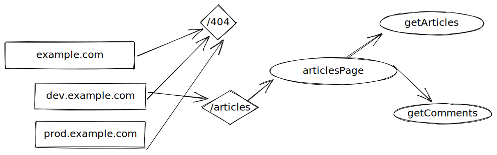

# Fide

**F**unctions as service **I**ntegrated **D**evelopment **E**nvironment

## Vision

Fide allows you to explore the FAAS environment of your choice with the emphasis on making you as a developer the most productive. It includes an IDE that lets you change the code of your functions directly in the IDE, trigger requests against it, iterate through automatic deployments, and in the end exports the updated version back into your source control to integrate best with your CI/CD workflow. Fide also allows you to plug in external data sources to give you relevant information about performance characteristics, network layouts, or whatever is relevant to your application.
Fide is designed from the start to work with different FAAS providers like Tekton, OpenFaas and AWS Lambda functions.

### Mockups

#### Overview Page

Get an idea of your projects structure through the overview page.

#### Edit Page

Edit your function in our IDE

## Roadmap

We are currently in the first iterations of Fide, leading to a messy way ahead. 
Once we get more stable we will add a proper Roadmap, but for now please visit the [GitHub Project we use to coordinate](https://github.com/faas-ide/fide/projects/1).
