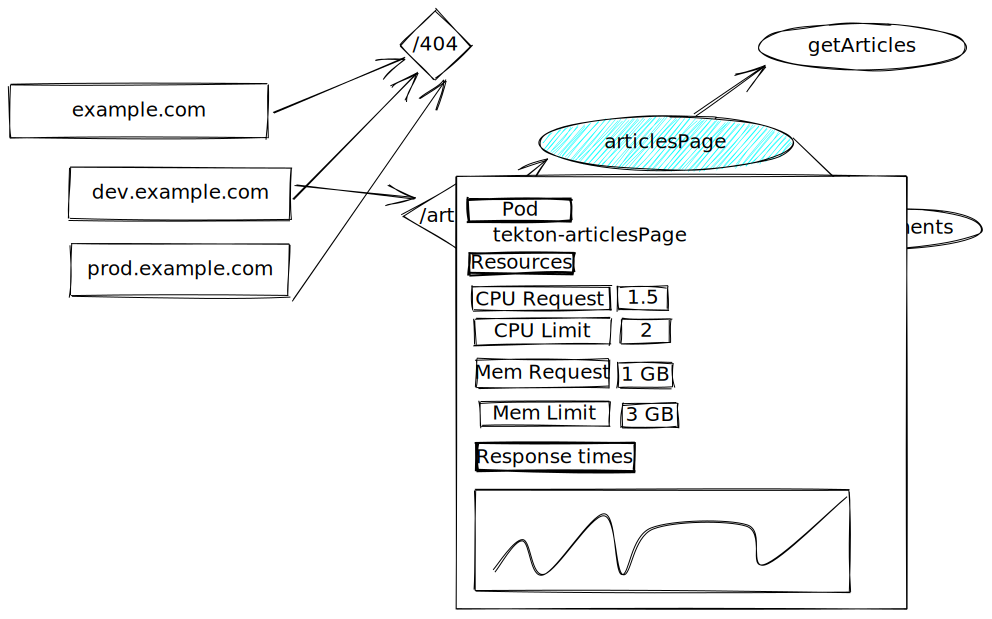

# Support Multiple Backends

## Table of Contents

A table of contents is helpful for quickly jumping to sections of a KEP and for highlighting any additional information provided beyond the standard KEP template.
[Tools for generating][] a table of contents from markdown are available.

- [Support Multiple Backends](#support-multiple-backends)
  - [Table of Contents](#table-of-contents)
  - [Summary](#summary)
  - [Motivation](#motivation)
    - [Goals](#goals)
    - [Non-Goals](#non-goals)
  - [Proposal](#proposal)
    - [Implementation Details/Notes/Constraints](#implementation-detailsnotesconstraints)
    - [Risks and Mitigations](#risks-and-mitigations)
  - [Graduation Criteria](#graduation-criteria)
  - [Alternatives](#alternatives)
    - [Self-expressing providers](#self-expressing-providers)

[tools for generating]: https://github.com/ekalinin/github-markdown-toc

## Summary

To make Fide useful to a variety of FAAS enthusiasts we want to support running Fide against multiple backends like Tekton on Kubernetes, OpenFAAS on Kubernetes, AWS Lambda Function, and Google Cloud Functions.
Finding an abstraction that supports all of these offerings, leveraging their strengths while also allowing Fide to make use of its features is crucial to having a good development workflow.

## Motivation

To make Fide useful to any user it must at the same time be able to provide its features, e.g. showing an overview of your architecture, CRUD actions on the functions, auto-deploying, or exporting the functions into a deployable format.

Fide must also be able to adjust to the environment it's deployed in. On Kubernetes-based backends, a user would expect information around the pod the function is scheduled in for debugging, whereas on public cloud FAAS offerings one might want to link to their dashboard.

### Goals

- Support Tekton on Kubernetes, OpenFAAS on Kubernetes, AWS Lambda Function, and Google Cloud Functions as backends for the FAAS offering in Fide
- Seamlessly integrate into the backend of our choice, showing rich information
- Allow the open source community to extend fide with their own FAAS solution, ideally without needing to add source code to Fide itself.

### Non-Goals

- Support multiple backends at the same point in time. While ideally this option should be achievable with the chosen design it is not a priority as of right now.
- Enhance information shown with external information like logs, or metrics. While this is a goal we pursuit it is outside of the scope of this document.
- Describe the plugin loading mechanism. This is dependant on the language of choice and seen as an implementation detail.

## Proposal

We want to enable said goals by implementing a plugin architecture that defines a contract for a FAAS Provider to fulfil to be compatible with Fide. The interface will look like this:

```ts
// Typescript is used for illustration purposes and does not need to be the language of choice
// The final language we want to use is still TBD.

// Imported from Fide
type StringValidator = (value: unknown) => string;
type NumberValidator = (value: unknown) => number;
type BooleanValidator = (value: unknown) => boolean;
type Validator = StringValidator | NumberValidator | BooleanValidator;
type ExecutionContextSchema = Record<string, Validator>;
type ExecutionContext = Record<string, string | boolean | number>;

export const providerId = "my-provider";
export const executionContext: ExecutionContextSchema = {
  // e.g. for AWS
  awsProfile: string(),

  // e.g. for Kubernetes
  kubeConfig: string(),
};

export function validateContext(context: ExecutionContext) {
  // e.g. for AWS
  try {
    awsClient.checkPermissions({ profile: context.awsProfile });
  } catch (e) {
    throw new PermissionError(
      "You are missing access to s3, please check your AWS configuration"
    );
  }

  // e.g. for Kubernetes
  const client = new Client(context.kubeConfig);
  try {
    client.getPods();
  } catch (e) {
    throw new PermissionError(
      "You are missing access to get pods, please check your kubeconfig"
    );
  }
}

// global provider-wide id
type ID = string;

// AWS ELB or Kubernetes Ingress Resource
type Ingress = {
  id: ID,
  address: string,
  port: number,
};

type Route = {
  id: ID,
  ingress: ID,
  path: string,
};

type Function = {
  id: ID,
  route: ID,
  parameters: Record<string, string | number | boolean>,
  name: string,
  fs: Filesystem,
};

type Filesystem = {
  files: File[],
};

type File = {
  path: string,
  content: string,
};

type Component = Ingress | Route | Function;
type State = {
  entities: Component[],
};

type EntryFormat = {
  headline: string,
  data: string,
};

type GraphFormat = {
  headline?: string,
  data: string[][],
  color: string,
  line: string,
};

type TableFormat = {
  headline?: string,
  data: string[][],
};

type MetaFormat = EntryFormat | GraphFormat | TableFormat;

type Meta = {
  id: ID,
  position?: number,
} & MetaFormat;

export function getState(): State {}
export function get(componentId: ID): Component {}
export function getMetadata(componentId: ID): Meta[] {}
export function create(component: Omit<Component, "id">): Component {}
export function update(component: Component): boolean {}
export function delete(component: Component): boolean {}
export function watch(
  ids?: string[],
  onData: (data: Component[]) => void,
  onError: (error: Error) => void
): void {}
```

To display meta information in a useful way we include it in the overview page in a separate modal / subview so it can be loaded in a separate request. The provider can decide what to show, one example could look like this:



### Implementation Details/Notes/Constraints

The language of our choice needs to support a plugin system.

### Risks and Mitigations

This implementation chooses to use the lowest common denominator between the platform. This can lead to a sub-par experience using Fide as information is missing or it can widen the interface over time, making it harder for provider creators to keep up with the ecosystem.
The meta component mitigates this problem as it allows the creator of a provider to extend the pre-defined interface with information important to their platform while keeping an integrated look to the user by keeping the UI Components themselves within the authority of Fide.

## Graduation Criteria

The implementation is finished when all workflows of Fide are implemented for one backend provider through the plugin interface.

## Alternatives

### Self-expressing providers

Instead of defining the interface on the data level, we could define it on the UI level.
The provider would be in charge of declaring its interface directly and Fide would use this to render the view. This would allow providers to freely express the interface best suited for their provider directly. The work required to get a provider going would not only need detailed knowledge on the FAAS provider but also a good grasp on UI concepts making the entry-barrier for new providers higher.
We decided against this as loosening up the interface is easier than tightening it once providers are out in the wild.
